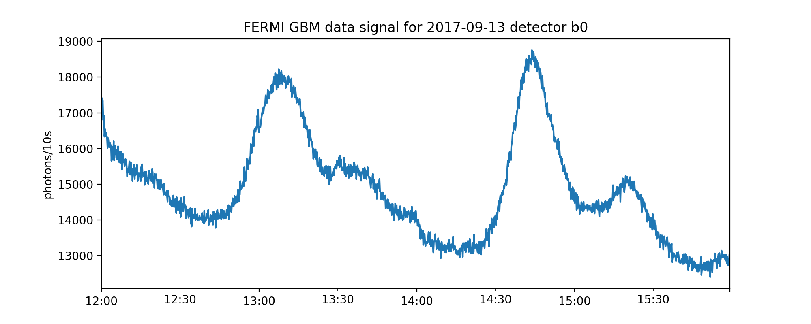

# Plots

All plots are presented in the order they appear in the paper, with a description of the workflow used to produce them.

**Figure 1**: Plots of two recorded gamma ray bursts from the FERMI catalogue, with photon
counts binned into 0.2s and 2s intervals.

 

Produced in plot-creation/other_plots.ipynb.

**Figure 2**: Example 4 hours of background data from one detector, grouped into 10 second
bins to show background rate fluctuations.

Produced using fermi_data.ipynb with data from HEASARC repository to create image and corresponding raw data file. Raw data file is approx 40MB in size and is also used in later image creation (figures 12, 13)

**Figure 3**: A schematic of the detection system, with the arrow thickness corresponding to the relative velocities of data flows. Most of the computing requirements of the trigger algorithm are within the detection loop, highlighted in green.

Produced using MS Powerpoint flowchart maker.

**Figure 4**: A simulated example anomaly with intensity multiplier μ = 3 and duration
h = 20 against a background λ = 2

Produced in other_plots.ipynb

**Figure 5**: Detectability of GRBs at different k-sigma levels. Shaded regions show values of
hλ and μ_{t+1:t+h} where the likelihood ratio exceeds k-sigma event thresholds for k = 3 (blue
region), k = 5 (orange region) and k = 7 (green region) for a test that uses the correct
value of h.

Produced in other_plots.ipynb

**Figure 6**: Detectability of GRBs by the window method, for one window (left) or a grid of three windows (right). The orange shaded area shows the values of hλ and μ_{t+1:t+h} where the likelihood ratio exceeds a 5-sigma threshold, and the blue shaded area shows the detectability region form Figure 5. Dashed lines show expected count hλ over the window.

 

Produced in other_plots.ipynb

**Figure 7**: Detectability of GRBs by Page-CUSUM for a single μ value (left) and a grid of three μ values (right).  Orange shaded area shows the values of hλ and μ_{t+1:t+h} where the likelihood ratio exceeds a 5-sigma threshold; % for the Page-CUSUM (μ value shown by dashed vertical line). For comparison, the green shaded area shows the detectability region for the corresponding %expected count hλ window test as defined by Proposition 2 (left-hand plot); and the blue shaded area shows the detectability region from Figure 5.

 

Produced in other_plots.ipynb

**Figure 8**: Three example logarithmic curves. The statistic S_T(μ) is defined as the maximum of all logarithmic  curves and the 0 line.

Produced in other_plots.ipynb

**Figure 9**: Comparisons of the number of windows and expected number of curves (average over 1000 runs) kept by FOCuS running over a signal with base rate $\lambda=100$ using a 5-sigma threshold, with on constraint on length of GRB (left) and with h_{max}=1024, corresponding to μ_{min}=1.02 (right).

 

Produced in expected_curve_plots.ipynb

**Figure 10**: Comparison between FOCuS and logarithmic window method showing the
average run length at different sigma levels.

Produced in average_run_length.ipynb

**Figure 11**: Plots of runs of FOCuS over simulated GRB copies of different brightnesses

   
   
 

The plots created here use simple B=pL/100000 scaling for a background B and a fractional lightcurve L simulated with 100000 photons, data of which is available in simulations.csv, with the workflow in lightcurve_simulations.ipynb. The plots in the paper were done uing simulations_of_real_grbs.ipynb which draws on a lightcurve simulation code package that cannot be made available. The underlying point is the same: some bursts will be better found using an exhaustive search (such as FOCuS), and for others the most promising interval in the burst will line up exactly with the logarithmic window grid.

**Figure 12**: An hour's portion of the same data from Figure 2 at higher resolution of 50ms (blue). In black is the data at 10s resolution identical to that from Figure 2 but rescaled by 0.005x to fit the graph. In orange is a centered 3 minute moving-average background estimate (linewidth increased for visual clarity).

Produced using background_bias.ipynb

**Figure 13**: Plots of a run of FOCuS over the data using various background estimation methods and parameters.
    
  

Produced using background_bias.ipynb

**Figure 14**: Three of the triggers found in the FERMI daily data. Left-hand column shows data from the two detectors that give a trigger, and the right-hand column shows the corresponding output from the Poisson-FOCuS algorithm.

   
   
 

Produced using fermi_analysis.ipynb 

**Figure 15**: Plots of τ-1 for each anomaly start point τ compared to the random walk Z_t-tλ.

Produced in expected_curve_plots.ipynb

**Figure 16**:  Left: one hour’s worth of FERMI data binned into 10ms intervals. Right: au-
tocorrelation plot from the data put through a variance-stabilising transformation (square
root) and then rolling mean of window size 500 subtracted off to account for changes in
background rate. Negligible autocorrelation is present.

 

Produced in fermi_data.ipynb from a HEASARC data file

